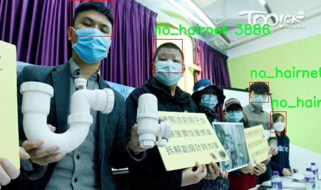

# 厨房头巾佩戴检测检测系统源码分享
 # [一条龙教学YOLOV8标注好的数据集一键训练_70+全套改进创新点发刊_Web前端展示]

### 1.研究背景与意义

项目参考[AAAI Association for the Advancement of Artificial Intelligence](https://gitee.com/qunmasj/projects)

项目来源[AACV Association for the Advancement of Computer Vision](https://github.com/qunshansj/good)

研究背景与意义

随着社会经济的发展和人们生活水平的提高，食品安全和卫生问题日益受到重视。在餐饮行业，厨房工作人员的卫生习惯直接影响到食品的安全性和消费者的健康。因此，厨房头巾的佩戴成为了餐饮行业卫生管理的重要环节之一。厨房头巾不仅能够有效防止头发掉落到食品中，还能减少细菌和其他污染物的传播。为了确保厨房工作人员遵循卫生规范，开发一种高效、准确的厨房头巾佩戴检测系统显得尤为重要。

近年来，计算机视觉技术的快速发展为物体检测提供了新的解决方案。YOLO（You Only Look Once）系列模型因其高效的实时检测能力和良好的准确性，广泛应用于各类物体检测任务。YOLOv8作为该系列的最新版本，进一步提升了检测精度和速度，适合在复杂环境中进行实时监控。然而，针对厨房头巾佩戴检测的特定需求，YOLOv8模型仍需进行改进，以适应不同光照、角度和背景下的检测挑战。

本研究基于改进YOLOv8模型，构建一个厨房头巾佩戴检测系统，旨在通过计算机视觉技术实现对厨房工作人员佩戴头巾情况的自动监测。为此，我们构建了一个包含3643张图像的数据集，分为“佩戴头巾”和“未佩戴头巾”两个类别。这一数据集的多样性和丰富性为模型的训练提供了良好的基础，使其能够在不同场景下进行有效的检测。

该系统的意义不仅在于提升厨房卫生管理的效率，还在于推动智能监控技术在餐饮行业的应用。通过自动化检测，管理者可以实时监控厨房工作人员的卫生状况，及时发现并纠正不规范行为，从而有效降低食品安全风险。此外，该系统还可以为其他行业的卫生管理提供借鉴，如医疗、制药等领域，进一步拓展计算机视觉技术的应用范围。

综上所述，基于改进YOLOv8的厨房头巾佩戴检测系统的研究，不仅具有重要的理论价值，也具备广泛的实际应用前景。通过该系统的开发与应用，能够为提升餐饮行业的卫生标准和食品安全水平提供有力支持，促进社会对食品安全问题的关注与重视。

### 2.图片演示


##### 注意：由于此博客编辑较早，上面“2.图片演示”和“3.视频演示”展示的系统图片或者视频可能为老版本，新版本在老版本的基础上升级如下：（实际效果以升级的新版本为准）

  （1）适配了YOLOV8的“目标检测”模型和“实例分割”模型，通过加载相应的权重（.pt）文件即可自适应加载模型。

  （2）支持“图片识别”、“视频识别”、“摄像头实时识别”三种识别模式。

  （3）支持“图片识别”、“视频识别”、“摄像头实时识别”三种识别结果保存导出，解决手动导出（容易卡顿出现爆内存）存在的问题，识别完自动保存结果并导出到tempDir中。

  （4）支持Web前端系统中的标题、背景图等自定义修改，后面提供修改教程。

  另外本项目提供训练的数据集和训练教程,暂不提供权重文件（best.pt）,需要您按照教程进行训练后实现图片演示和Web前端界面演示的效果。

### 3.视频演示

[3.1 视频演示](https://www.bilibili.com/video/BV1gZpte7Emj/)

### 4.数据集信息展示

##### 4.1 本项目数据集详细数据（类别数＆类别名）

nc: 2
names: ['hairnet', 'no_hairnet']


##### 4.2 本项目数据集信息介绍

数据集信息展示

在本研究中，我们采用了名为“hairnet”的数据集，以训练和改进YOLOv8模型，旨在实现厨房头巾佩戴检测系统的高效识别。该数据集专门设计用于区分佩戴厨房头巾与未佩戴厨房头巾的情况，具有明确的分类目标和丰富的样本数据。数据集的类别数量为2，具体类别包括“hairnet”和“no_hairnet”。这一简单而有效的分类结构使得模型能够在实际应用中快速而准确地判断个体是否佩戴了厨房头巾，从而在食品安全和卫生管理方面发挥重要作用。

“hairnet”数据集的构建考虑到了厨房环境的多样性和复杂性，样本涵盖了不同性别、年龄、种族和体型的个体，确保了模型训练的多样性和泛化能力。此外，数据集中还包含了多种厨房场景的图像，如不同的厨房布局、光照条件和背景环境，这些因素都可能影响头巾的可见性和识别难度。通过这样的设计，数据集不仅提供了丰富的样本，还增强了模型在真实世界应用中的适应性。

在数据标注方面，所有图像均经过专业人员的精确标注，确保每个样本的标签准确无误。标注过程采用了严格的质量控制标准，以避免因标注错误而影响模型的训练效果。每个图像中，佩戴厨房头巾的个体被标记为“hairnet”，而未佩戴的个体则标记为“no_hairnet”。这种清晰的标注方式为YOLOv8模型的训练提供了坚实的基础，使其能够有效学习到区分这两类目标的特征。

在数据集的规模方面，“hairnet”数据集包含了大量的图像样本，确保了模型训练的充分性。数据集的丰富性不仅体现在样本数量上，还体现在样本的多样性上。为了进一步提升模型的鲁棒性，数据集还包含了一些经过数据增强处理的图像，例如旋转、缩放、亮度调整等。这些增强手段旨在模拟不同的拍摄条件和环境变化，使得训练出的模型能够在各种实际场景中保持良好的性能。

在模型训练过程中，我们将“hairnet”数据集分为训练集、验证集和测试集，以便于评估模型的性能和泛化能力。训练集用于模型的学习，验证集用于调参和模型选择，而测试集则用于最终的性能评估。通过这种科学的划分方式，我们能够全面了解模型在不同数据集上的表现，从而确保其在实际应用中的可靠性。

综上所述，“hairnet”数据集为厨房头巾佩戴检测系统的研究提供了重要的支持。其明确的分类结构、丰富的样本多样性和高质量的标注，使得YOLOv8模型能够在这一特定任务上实现优异的性能。随着数据集的不断完善和模型的持续优化，我们期待这一系统能够在实际厨房环境中发挥重要作用，为食品安全和卫生管理提供有效保障。





### 5.全套项目环境部署视频教程（零基础手把手教学）

[5.1 环境部署教程链接（零基础手把手教学）](https://www.ixigua.com/7404473917358506534?logTag=c807d0cbc21c0ef59de5)


[5.2 安装Python虚拟环境创建和依赖库安装视频教程链接（零基础手把手教学）](https://www.ixigua.com/7404474678003106304?logTag=1f1041108cd1f708b01a)

### 6.手把手YOLOV8训练视频教程（零基础小白有手就能学会）

[6.1 环境部署教程链接（零基础手把手教学）](https://www.ixigua.com/7404477157818401292?logTag=d31a2dfd1983c9668658)

### 7.70+种全套YOLOV8创新点代码加载调参视频教程（一键加载写好的改进模型的配置文件）

[7.1 环境部署教程链接（零基础手把手教学）](https://www.ixigua.com/7404478314661806627?logTag=29066f8288e3f4eea3a4)

### 8.70+种全套YOLOV8创新点原理讲解（非科班也可以轻松写刊发刊，V10版本正在科研待更新）

由于篇幅限制，每个创新点的具体原理讲解就不一一展开，具体见下列网址中的创新点对应子项目的技术原理博客网址【Blog】：


[8.1 70+种全套YOLOV8创新点原理讲解链接](https://gitee.com/qunmasj/good)

### 9.系统功能展示（检测对象为举例，实际内容以本项目数据集为准）

图9.1.系统支持检测结果表格显示

  图9.2.系统支持置信度和IOU阈值手动调节

  图9.3.系统支持自定义加载权重文件best.pt(需要你通过步骤5中训练获得)

  图9.4.系统支持摄像头实时识别

  图9.5.系统支持图片识别

  图9.6.系统支持视频识别

  图9.7.系统支持识别结果文件自动保存

  图9.8.系统支持Excel导出检测结果数据


### 10.原始YOLOV8算法原理

原始YOLOv8算法原理

YOLOv8是Ultralytics公司在2023年推出的目标检测算法，它在YOLO系列的基础上进行了重要的改进和优化，旨在提供更高的准确性和更快的推理速度。YOLOv8的设计理念围绕着快速、准确和易于使用展开，使其成为目标检测、图像分割和图像分类等任务的理想选择。其网络结构主要由三个部分组成：Backbone、Neck和Head，每个部分都经过精心设计，以提高整体性能。

在输入阶段，YOLOv8默认的图像尺寸为640x640，但在实际应用中，图像的长宽比往往各不相同。为了解决这一问题，YOLOv8采用了自适应图片缩放的方法。在测试或推理时，算法会将图像的长边按比例缩小到指定尺寸，然后对短边进行填充。这种处理方式有效减少了填充带来的信息冗余，从而提高了目标检测的速度和准确性。此外，在模型训练阶段，YOLOv8引入了Mosaic图像增强技术，通过将四张随机选择的图像进行缩放和拼接，生成新的训练样本。这种增强方式不仅丰富了训练数据，还促使模型学习到不同位置和周围像素的特征，从而提升了预测精度。

YOLOv8的Backbone部分是其核心特征提取模块，采用了C2F模块替代了YOLOv5中的C3模块。C2F模块通过并行多个梯度流分支来提取特征，保证了模型的轻量化同时又能获得更丰富的梯度信息。这种设计灵感来源于YOLOv7中的ELAN模块，旨在提高特征提取的效率和精度。Backbone的设计不仅提升了特征提取的能力，还为后续的特征融合和目标检测打下了坚实的基础。

在Neck部分，YOLOv8对特征融合进行了进一步的优化。与YOLOv5相比，YOLOv8去除了两次上采样之前的1x1卷积连接层，直接对Backbone不同阶段输出的特征进行上采样。这种简化的结构使得特征融合更加高效，有助于捕捉不同尺度目标的信息，从而提高了目标检测的性能和鲁棒性。Neck部分的设计不仅关注特征的融合，还考虑到了不同尺度目标的检测需求，使得YOLOv8在处理多尺度目标时表现得更加出色。

YOLOv8的Head部分是其最显著的创新之一。该部分从传统的Coupled-Head（耦合头）转变为Decoupled-Head（解耦头），将检测和分类的卷积操作分开处理。这一改变使得模型在进行目标检测时，能够更专注于每个任务的特定需求，进而提高了检测的准确性。在解耦头中，输入的特征图首先通过两个1x1的卷积模块进行降维，然后分别用于类别预测和边界框位置及IoU（交并比）预测。此外，YOLOv8在损失函数的设计上也进行了创新，取消了Obj分支，并在分类分支中采用了BCELoss（Binary Cross Entropy Loss），而在边界框回归分支中则使用了DFL（Distribution Focal Loss）和CIoULoss（Complete Intersection over Union Loss）。这种设计旨在使网络模型能够快速聚焦于标签附近的数值，从而提高检测精度。

YOLOv8还抛弃了以往的Anchor-Based（基于锚框）方法，转而采用Anchor-Free（无锚框）的方法。这一转变使得目标检测的过程更加灵活，不再需要在训练之前对数据集进行锚框的聚类和设置。Anchor-Free方法将目标检测转化为关键点检测，简化了网络结构，提高了模型的泛化能力。通过这一创新，YOLOv8能够在不同的检测任务中展现出更高的适应性和效率。

总的来说，YOLOv8在网络结构、特征提取、特征融合和目标检测等多个方面进行了深度优化，使其在准确性和速度上都得到了显著提升。其轻量化的设计理念和灵活的架构使得YOLOv8能够广泛应用于各种计算机视觉任务中，成为目标检测领域的重要工具。通过对YOLOv8的深入理解，我们可以更好地应用这一先进的算法，推动目标检测技术的发展。


### 11.项目核心源码讲解（再也不用担心看不懂代码逻辑）

#### 11.1 ultralytics\models\fastsam\val.py

以下是对给定代码的核心部分进行提炼和详细注释的结果：

```python
# 导入必要的模块
from ultralytics.models.yolo.segment import SegmentationValidator
from ultralytics.utils.metrics import SegmentMetrics

class FastSAMValidator(SegmentationValidator):
    """
    自定义验证类，用于快速SAM（Segment Anything Model）分割，基于Ultralytics YOLO框架。

    该类扩展了SegmentationValidator，专门定制了快速SAM的验证过程。将任务设置为“分割”，并使用SegmentMetrics进行评估。
    此外，为了避免在验证过程中出现错误，禁用了绘图功能。
    """

    def __init__(self, dataloader=None, save_dir=None, pbar=None, args=None, _callbacks=None):
        """
        初始化FastSAMValidator类，将任务设置为“分割”，并将指标设置为SegmentMetrics。

        参数：
            dataloader (torch.utils.data.DataLoader): 用于验证的数据加载器。
            save_dir (Path, optional): 保存结果的目录。
            pbar (tqdm.tqdm): 用于显示进度的进度条。
            args (SimpleNamespace): 验证器的配置。
            _callbacks (dict): 存储各种回调函数的字典。

        注意：
            为了避免错误，本类禁用了ConfusionMatrix和其他相关指标的绘图功能。
        """
        # 调用父类的初始化方法
        super().__init__(dataloader, save_dir, pbar, args, _callbacks)
        
        # 设置任务类型为“分割”
        self.args.task = "segment"
        
        # 禁用绘图功能以避免错误
        self.args.plots = False
        
        # 初始化分割指标
        self.metrics = SegmentMetrics(save_dir=self.save_dir, on_plot=self.on_plot)
```

### 代码核心部分分析：

1. **类定义**：
   - `FastSAMValidator` 继承自 `SegmentationValidator`，这是一个专门用于分割任务的验证器。

2. **构造函数**：
   - `__init__` 方法初始化验证器，设置任务类型为“分割”，并禁用绘图功能，以防止在验证过程中出现错误。

3. **属性设置**：
   - `self.args.task` 被设置为 "segment"，表示当前的任务是分割。
   - `self.args.plots` 被设置为 `False`，表示不生成绘图，避免潜在的错误。
   - `self.metrics` 使用 `SegmentMetrics` 来计算分割性能指标，便于后续的评估和分析。

通过这些核心部分的设置，`FastSAMValidator` 类能够专注于快速SAM模型的分割验证，确保在验证过程中高效且无错误。

这个文件是一个用于快速分割模型（Fast SAM）的验证器类，名为 `FastSAMValidator`，它继承自 `SegmentationValidator` 类，属于 Ultralytics YOLO 框架的一部分。该类的主要功能是定制化验证过程，以适应快速分割模型的需求。

在类的文档字符串中，说明了这个验证器的目的和功能。它专门用于快速 SAM 分割，设置了任务类型为“分割”，并使用 `SegmentMetrics` 进行评估。此外，为了避免在验证过程中出现错误，该类禁用了绘图功能。

在初始化方法 `__init__` 中，构造函数接受多个参数，包括数据加载器、结果保存目录、进度条对象、额外的配置参数以及回调函数的字典。通过调用父类的构造函数，初始化了基本的验证器功能。接着，设置了任务类型为“segment”，并将绘图功能禁用，以避免在验证过程中可能出现的错误。最后，实例化了 `SegmentMetrics`，用于后续的评估。

总体来说，这个文件定义了一个专门用于快速 SAM 模型的验证器，简化了验证过程，并确保在验证时不会出现绘图相关的错误。

#### 11.2 ui.py

以下是经过简化并添加详细中文注释的核心代码部分：

```python
import sys
import subprocess

def run_script(script_path):
    """
    使用当前 Python 环境运行指定的脚本。

    参数:
        script_path (str): 要运行的脚本路径

    返回:
        None
    """
    # 获取当前 Python 解释器的路径
    python_path = sys.executable

    # 构建运行命令，使用 streamlit 运行指定的脚本
    command = f'"{python_path}" -m streamlit run "{script_path}"'

    # 执行命令并等待其完成
    result = subprocess.run(command, shell=True)
    
    # 检查命令执行结果，如果返回码不为0，表示出错
    if result.returncode != 0:
        print("脚本运行出错。")

# 如果该脚本是主程序，则执行以下代码
if __name__ == "__main__":
    # 指定要运行的脚本路径
    script_path = "web.py"  # 假设脚本在当前目录下

    # 调用函数运行指定的脚本
    run_script(script_path)
```

### 代码注释说明：
1. **导入模块**：
   - `sys`：用于获取当前 Python 解释器的路径。
   - `subprocess`：用于执行外部命令。

2. **定义 `run_script` 函数**：
   - 此函数接受一个脚本路径作为参数，并在当前 Python 环境中运行该脚本。

3. **获取 Python 解释器路径**：
   - 使用 `sys.executable` 获取当前 Python 解释器的完整路径。

4. **构建命令**：
   - 使用 f-string 格式化字符串构建运行命令，调用 `streamlit` 模块来运行指定的脚本。

5. **执行命令**：
   - 使用 `subprocess.run` 执行构建的命令，并设置 `shell=True` 以在 shell 中运行。

6. **检查执行结果**：
   - 通过检查 `result.returncode` 来判断命令是否成功执行，若不为0，则输出错误信息。

7. **主程序入口**：
   - 使用 `if __name__ == "__main__":` 确保只有在该脚本作为主程序运行时才会执行以下代码。
   - 指定要运行的脚本路径（在此示例中为 `web.py`），并调用 `run_script` 函数。

这个程序文件名为 `ui.py`，主要功能是使用当前的 Python 环境来运行一个指定的脚本，具体是通过 Streamlit 框架来启动一个 Web 应用。

程序首先导入了必要的模块，包括 `sys`、`os` 和 `subprocess`，这些模块分别用于访问 Python 解释器的信息、处理文件和目录，以及执行外部命令。接着，从 `QtFusion.path` 模块中导入了 `abs_path` 函数，这个函数的作用是获取给定路径的绝对路径。

在 `run_script` 函数中，首先定义了一个参数 `script_path`，用于接收要运行的脚本的路径。函数内部首先获取当前 Python 解释器的路径，并将其存储在 `python_path` 变量中。然后，构建一个命令字符串 `command`，这个命令用于调用 Streamlit 来运行指定的脚本。命令的格式是 `python -m streamlit run "script_path"`，其中 `script_path` 是传入的脚本路径。

接下来，使用 `subprocess.run` 方法执行构建好的命令。如果命令执行后返回的状态码不为 0，表示脚本运行出错，程序会输出一条错误信息。

在文件的最后部分，使用 `if __name__ == "__main__":` 语句来确保当这个文件作为主程序运行时，以下代码才会被执行。这里指定了要运行的脚本路径为 `web.py`，并调用 `run_script` 函数来执行这个脚本。

总的来说，这个程序的主要功能是通过 Streamlit 框架来启动一个 Web 应用，方便用户在浏览器中访问。

#### 11.3 ultralytics\models\yolo\detect\val.py

以下是代码中最核心的部分，并附上详细的中文注释：

```python
class DetectionValidator(BaseValidator):
    """
    扩展自 BaseValidator 类的检测模型验证器。
    """

    def __init__(self, dataloader=None, save_dir=None, pbar=None, args=None, _callbacks=None):
        """初始化检测模型所需的变量和设置。"""
        super().__init__(dataloader, save_dir, pbar, args, _callbacks)
        self.nt_per_class = None  # 每个类别的目标数量
        self.is_coco = False  # 是否为 COCO 数据集
        self.class_map = None  # 类别映射
        self.args.task = "detect"  # 任务类型设置为检测
        self.metrics = DetMetrics(save_dir=self.save_dir, on_plot=self.on_plot)  # 初始化检测指标
        self.iouv = torch.linspace(0.5, 0.95, 10)  # mAP@0.5:0.95 的 IoU 向量
        self.niou = self.iouv.numel()  # IoU 的数量
        self.lb = []  # 用于自动标记

    def preprocess(self, batch):
        """对 YOLO 训练的图像批次进行预处理。"""
        # 将图像数据移动到设备上，并进行归一化处理
        batch["img"] = batch["img"].to(self.device, non_blocking=True)
        batch["img"] = (batch["img"].half() if self.args.half else batch["img"].float()) / 255
        # 将其他数据也移动到设备上
        for k in ["batch_idx", "cls", "bboxes"]:
            batch[k] = batch[k].to(self.device)

        # 如果需要保存混合数据，进行相应处理
        if self.args.save_hybrid:
            height, width = batch["img"].shape[2:]
            nb = len(batch["img"])
            bboxes = batch["bboxes"] * torch.tensor((width, height, width, height), device=self.device)
            self.lb = (
                [
                    torch.cat([batch["cls"][batch["batch_idx"] == i], bboxes[batch["batch_idx"] == i]], dim=-1)
                    for i in range(nb)
                ]
                if self.args.save_hybrid
                else []
            )  # 用于自动标记

        return batch

    def postprocess(self, preds):
        """对预测输出应用非极大值抑制。"""
        return ops.non_max_suppression(
            preds,
            self.args.conf,
            self.args.iou,
            labels=self.lb,
            multi_label=True,
            agnostic=self.args.single_cls,
            max_det=self.args.max_det,
        )

    def update_metrics(self, preds, batch):
        """更新指标统计信息。"""
        for si, pred in enumerate(preds):
            self.seen += 1  # 记录已处理的样本数量
            npr = len(pred)  # 当前预测的数量
            stat = dict(
                conf=torch.zeros(0, device=self.device),
                pred_cls=torch.zeros(0, device=self.device),
                tp=torch.zeros(npr, self.niou, dtype=torch.bool, device=self.device),
            )
            pbatch = self._prepare_batch(si, batch)  # 准备当前批次数据
            cls, bbox = pbatch.pop("cls"), pbatch.pop("bbox")  # 获取真实标签和边界框
            nl = len(cls)  # 真实标签数量
            stat["target_cls"] = cls  # 记录目标类别

            if npr == 0:  # 如果没有预测结果
                if nl:
                    for k in self.stats.keys():
                        self.stats[k].append(stat[k])
                continue

            # 处理预测结果
            predn = self._prepare_pred(pred, pbatch)  # 准备预测数据
            stat["conf"] = predn[:, 4]  # 置信度
            stat["pred_cls"] = predn[:, 5]  # 预测类别

            # 评估
            if nl:
                stat["tp"] = self._process_batch(predn, bbox, cls)  # 计算真阳性
            for k in self.stats.keys():
                self.stats[k].append(stat[k])  # 更新统计信息

    def get_stats(self):
        """返回指标统计信息和结果字典。"""
        stats = {k: torch.cat(v, 0).cpu().numpy() for k, v in self.stats.items()}  # 转换为 numpy 数组
        if len(stats) and stats["tp"].any():
            self.metrics.process(**stats)  # 处理指标
        self.nt_per_class = np.bincount(
            stats["target_cls"].astype(int), minlength=self.nc
        )  # 计算每个类别的目标数量
        return self.metrics.results_dict  # 返回结果字典
```

### 代码核心部分说明：
1. **DetectionValidator 类**：继承自 `BaseValidator`，用于处理目标检测模型的验证。
2. **__init__ 方法**：初始化各种参数和指标，包括数据集类型、类别映射、检测指标等。
3. **preprocess 方法**：对输入的图像批次进行预处理，包括归一化和数据转移。
4. **postprocess 方法**：应用非极大值抑制，过滤掉冗余的预测框。
5. **update_metrics 方法**：更新当前批次的指标统计，包括真阳性、置信度等。
6. **get_stats 方法**：计算并返回当前验证的统计信息和结果。

以上部分是整个目标检测验证过程中的关键环节，负责数据的处理、指标的更新和结果的计算。

这个程序文件是Ultralytics YOLO模型的验证模块，主要用于在目标检测任务中评估模型的性能。程序首先导入了必要的库和模块，包括文件操作、数值计算、深度学习框架PyTorch以及Ultralytics提供的各种工具和类。

在文件中定义了一个名为`DetectionValidator`的类，它继承自`BaseValidator`类。这个类的主要功能是对YOLO模型进行验证，计算并输出各种评估指标。类的构造函数`__init__`初始化了一些必要的变量和设置，包括数据加载器、保存目录、进度条、参数等。它还定义了一些用于计算评估指标的变量，如`DetMetrics`和`ConfusionMatrix`。

`preprocess`方法用于对输入的图像批次进行预处理，包括将图像数据转换为合适的格式和范围。接着，`init_metrics`方法初始化评估指标，判断数据集是否为COCO格式，并设置相关的类映射和统计信息。

`get_desc`方法返回一个格式化的字符串，用于总结YOLO模型的类指标。`postprocess`方法则对模型的预测结果应用非极大值抑制，以去除冗余的检测框。

`_prepare_batch`和`_prepare_pred`方法分别用于准备真实标签和模型预测的批次数据，以便进行后续的评估。`update_metrics`方法是关键部分，它计算并更新各种评估指标，包括真阳性、置信度和预测类别等。

`finalize_metrics`方法用于设置最终的评估指标值，而`get_stats`方法则返回评估统计信息和结果字典。`print_results`方法打印出训练或验证集的每个类的指标。

此外，程序还包含了一些辅助方法，如`build_dataset`和`get_dataloader`用于构建数据集和数据加载器，`plot_val_samples`和`plot_predictions`用于可视化验证样本和预测结果，`save_one_txt`和`pred_to_json`用于将检测结果保存为文本文件或JSON格式。

最后，`eval_json`方法用于评估YOLO输出的JSON格式，并返回性能统计信息，支持与COCO评估工具的集成。

整体而言，这个文件实现了YOLO模型在目标检测任务中的验证流程，包括数据预处理、指标计算、结果输出和可视化等功能。

#### 11.4 train.py

以下是经过简化并添加详细中文注释的核心代码部分：

```python
import os
import torch
import yaml
from ultralytics import YOLO  # 导入YOLO模型库
from QtFusion.path import abs_path  # 导入路径处理工具

# 确定使用的设备，如果有可用的GPU则使用GPU，否则使用CPU
device = "0" if torch.cuda.is_available() else "cpu"

if __name__ == '__main__':  # 确保该模块被直接运行时才执行以下代码
    # 设置工作进程和批次大小
    workers = 1
    batch = 2

    # 指定数据集名称
    data_name = "data"
    # 获取数据集配置文件的绝对路径
    data_path = abs_path(f'datasets/{data_name}/{data_name}.yaml', path_type='current')
    
    # 获取数据集目录路径
    directory_path = os.path.dirname(data_path)
    
    # 读取YAML配置文件
    with open(data_path, 'r') as file:
        data = yaml.load(file, Loader=yaml.FullLoader)
    
    # 如果YAML文件中包含'path'项，则修改为当前目录路径
    if 'path' in data:
        data['path'] = directory_path
        # 将修改后的数据写回YAML文件
        with open(data_path, 'w') as file:
            yaml.safe_dump(data, file, sort_keys=False)

    # 加载YOLOv8模型配置
    model = YOLO(model='./ultralytics/cfg/models/v8/yolov8s.yaml', task='detect')
    
    # 开始训练模型
    results2 = model.train(
        data=data_path,  # 指定训练数据的配置文件路径
        device=device,  # 指定使用的设备
        workers=workers,  # 指定使用的工作进程数
        imgsz=640,  # 指定输入图像的大小为640x640
        epochs=100,  # 指定训练的轮数为100
        batch=batch,  # 指定每个批次的大小
        name='train_v8_' + data_name  # 指定训练任务的名称
    )
```

### 代码注释说明：
1. **导入必要的库**：导入了处理文件路径、YAML文件和YOLO模型的库。
2. **设备选择**：根据是否有可用的GPU来选择计算设备。
3. **主程序入口**：确保只有在直接运行该脚本时才执行训练过程。
4. **设置参数**：定义工作进程数量和批次大小。
5. **数据集路径处理**：构建数据集配置文件的绝对路径，并读取该文件。
6. **YAML文件修改**：如果YAML文件中有'path'项，则更新为当前目录路径，并将修改后的内容写回文件。
7. **模型加载**：加载YOLOv8模型的配置文件。
8. **模型训练**：调用模型的训练方法，传入数据路径、设备、工作进程、图像大小、训练轮数、批次大小和任务名称等参数。

该程序文件`train.py`的主要功能是使用YOLOv8模型进行目标检测的训练。程序首先导入了必要的库，包括`os`、`torch`、`yaml`和`ultralytics`中的YOLO模型。接着，它会根据系统是否支持CUDA来选择设备，如果支持则使用GPU（设备编号为"0"），否则使用CPU。

在`__main__`模块中，程序设置了一些训练参数，包括工作进程数量`workers`和批次大小`batch`。接下来，程序定义了数据集的名称为`data`，并构建了数据集配置文件的绝对路径。通过调用`abs_path`函数，程序将相对路径转换为绝对路径，并将路径中的分隔符统一为Unix风格的斜杠。

程序获取了数据集配置文件所在的目录路径，并打开该YAML文件以读取数据。读取后，程序检查YAML文件中是否包含`path`项，如果有，则将其修改为数据集的目录路径，并将修改后的内容写回到YAML文件中。这一步确保了数据集路径的正确性。

随后，程序加载了YOLOv8模型的配置文件，准备进行目标检测的训练。可以看到，模型的配置文件路径是`./ultralytics/cfg/models/v8/yolov8s.yaml`，这是一个预训练的YOLOv8模型。

最后，程序调用`model.train`方法开始训练，传入了一系列参数，包括数据配置文件路径、设备、工作进程数量、输入图像大小（640x640）、训练的epoch数量（100）以及训练任务的名称（以`train_v8_`和数据集名称组合而成）。通过这些设置，程序将会启动YOLOv8模型的训练过程。

#### 11.5 ultralytics\utils\callbacks\raytune.py

以下是经过简化和注释的核心代码部分：

```python
# 导入必要的库
from ultralytics.utils import SETTINGS

# 尝试导入Ray和Tune库，并检查Ray Tune集成是否启用
try:
    assert SETTINGS["raytune"] is True  # 验证Ray Tune集成是否启用
    import ray
    from ray import tune
    from ray.air import session
except (ImportError, AssertionError):
    tune = None  # 如果导入失败或集成未启用，则将tune设置为None

def on_fit_epoch_end(trainer):
    """在每个训练周期结束时，将训练指标发送到Ray Tune。"""
    if ray.tune.is_session_enabled():  # 检查Ray Tune会话是否启用
        metrics = trainer.metrics  # 获取当前训练指标
        metrics["epoch"] = trainer.epoch  # 将当前周期数添加到指标中
        session.report(metrics)  # 向Ray Tune报告指标

# 定义回调函数，如果tune可用，则包含on_fit_epoch_end回调
callbacks = (
    {
        "on_fit_epoch_end": on_fit_epoch_end,  # 在每个周期结束时调用的回调
    }
    if tune
    else {}
)
```

### 代码注释说明：
1. **导入库**：导入`SETTINGS`用于检查Ray Tune的集成状态。
2. **异常处理**：尝试导入Ray和Tune库，如果导入失败或集成未启用，则将`tune`设置为`None`。
3. **回调函数**：`on_fit_epoch_end`函数在每个训练周期结束时被调用，用于将训练指标发送到Ray Tune。
4. **指标报告**：在会话启用的情况下，获取当前训练指标并报告给Ray Tune。
5. **回调定义**：根据`tune`是否可用，定义回调函数集合。

这个程序文件是一个用于集成Ray Tune的回调函数模块，主要用于在训练过程中将训练指标发送到Ray Tune，以便进行超参数调优和性能监控。

首先，文件引入了Ultralytics库中的设置（SETTINGS），并尝试检查Ray Tune的集成是否被启用。具体来说，它通过断言语句`assert SETTINGS["raytune"] is True`来验证。如果Ray Tune的集成未启用，程序会捕获`ImportError`或`AssertionError`异常，并将`tune`设置为`None`，这样后续的代码就不会执行Ray Tune相关的功能。

接下来，定义了一个名为`on_fit_epoch_end`的函数，该函数在每个训练周期结束时被调用。函数内部首先检查Ray Tune的会话是否已启用，如果启用，则获取当前训练器的指标（metrics），并将当前的训练周期（epoch）添加到指标中。最后，使用`session.report(metrics)`将这些指标报告给Ray Tune。

最后，文件定义了一个名为`callbacks`的元组，其中包含了一个字典，字典的键是`"on_fit_epoch_end"`，值是之前定义的`on_fit_epoch_end`函数。如果`tune`为`None`（即Ray Tune未启用），则这个字典为空。这种设计使得在使用Ray Tune时能够灵活地注册回调函数，而在未启用时则不会产生任何影响。

总的来说，这个文件的主要功能是实现与Ray Tune的集成，以便在训练过程中收集和报告训练指标，从而支持超参数调优和模型性能的监控。

#### 11.6 ultralytics\models\utils\ops.py

以下是代码中最核心的部分，并附上详细的中文注释：

```python
import torch
import torch.nn as nn
import torch.nn.functional as F
from scipy.optimize import linear_sum_assignment
from ultralytics.utils.metrics import bbox_iou

class HungarianMatcher(nn.Module):
    """
    实现匈牙利匹配器的模块，用于在端到端的方式中解决分配问题。
    匈牙利匹配器通过一个成本函数在预测的边界框和真实边界框之间执行最优分配。
    """

    def __init__(self, cost_gain=None, use_fl=True, with_mask=False, num_sample_points=12544, alpha=0.25, gamma=2.0):
        """初始化匈牙利匹配器，设置成本系数、Focal Loss、掩码预测、样本点和alpha、gamma因子。"""
        super().__init__()
        if cost_gain is None:
            cost_gain = {"class": 1, "bbox": 5, "giou": 2, "mask": 1, "dice": 1}
        self.cost_gain = cost_gain  # 成本系数
        self.use_fl = use_fl  # 是否使用Focal Loss
        self.with_mask = with_mask  # 是否使用掩码预测
        self.num_sample_points = num_sample_points  # 掩码成本计算中使用的样本点数量
        self.alpha = alpha  # Focal Loss中的alpha因子
        self.gamma = gamma  # Focal Loss中的gamma因子

    def forward(self, pred_bboxes, pred_scores, gt_bboxes, gt_cls, gt_groups, masks=None, gt_mask=None):
        """
        前向传播，计算预测与真实值之间的匹配。
        计算成本（分类成本、边界框之间的L1成本和GIoU成本），并基于这些成本找到最优匹配。
        """
        bs, nq, nc = pred_scores.shape  # 获取批次大小、查询数量和类别数量

        if sum(gt_groups) == 0:  # 如果没有真实目标，返回空的匹配
            return [(torch.tensor([], dtype=torch.long), torch.tensor([], dtype=torch.long)) for _ in range(bs)]

        # 将预测分数和边界框展平以计算成本矩阵
        pred_scores = pred_scores.detach().view(-1, nc)  # 展平预测分数
        pred_scores = F.sigmoid(pred_scores) if self.use_fl else F.softmax(pred_scores, dim=-1)  # 计算分类概率
        pred_bboxes = pred_bboxes.detach().view(-1, 4)  # 展平预测边界框

        # 计算分类成本
        pred_scores = pred_scores[:, gt_cls]  # 选择与真实类别对应的预测分数
        if self.use_fl:  # 如果使用Focal Loss
            neg_cost_class = (1 - self.alpha) * (pred_scores**self.gamma) * (-(1 - pred_scores + 1e-8).log())
            pos_cost_class = self.alpha * ((1 - pred_scores) ** self.gamma) * (-(pred_scores + 1e-8).log())
            cost_class = pos_cost_class - neg_cost_class  # 计算分类成本
        else:
            cost_class = -pred_scores  # 计算分类成本

        # 计算边界框之间的L1成本
        cost_bbox = (pred_bboxes.unsqueeze(1) - gt_bboxes.unsqueeze(0)).abs().sum(-1)  # 计算L1距离

        # 计算边界框之间的GIoU成本
        cost_giou = 1.0 - bbox_iou(pred_bboxes.unsqueeze(1), gt_bboxes.unsqueeze(0), xywh=True, GIoU=True).squeeze(-1)

        # 最终成本矩阵
        C = (
            self.cost_gain["class"] * cost_class
            + self.cost_gain["bbox"] * cost_bbox
            + self.cost_gain["giou"] * cost_giou
        )

        # 处理掩码成本（如果需要）
        if self.with_mask:
            C += self._cost_mask(bs, gt_groups, masks, gt_mask)

        # 将无效值（NaN和无穷大）设置为0
        C[C.isnan() | C.isinf()] = 0.0

        C = C.view(bs, nq, -1).cpu()  # 将成本矩阵重塑为(batch_size, num_queries, num_gt)
        indices = [linear_sum_assignment(c[i]) for i, c in enumerate(C.split(gt_groups, -1))]  # 进行匈牙利算法匹配
        gt_groups = torch.as_tensor([0, *gt_groups[:-1]]).cumsum_(0)  # 计算真实目标的索引
        return [
            (torch.tensor(i, dtype=torch.long), torch.tensor(j, dtype=torch.long) + gt_groups[k])
            for k, (i, j) in enumerate(indices)
        ]
```

### 代码核心部分说明：
1. **匈牙利匹配器的初始化**：在构造函数中，初始化了成本系数、是否使用Focal Loss、是否使用掩码预测等参数。
2. **前向传播**：在`forward`方法中，计算了预测边界框与真实边界框之间的匹配。通过计算分类成本、L1成本和GIoU成本，构建了最终的成本矩阵，并使用匈牙利算法进行匹配。
3. **成本计算**：包括分类成本的计算（支持Focal Loss）、边界框之间的L1距离和GIoU的计算。
4. **无效值处理**：将成本矩阵中的无效值（如NaN和无穷大）设置为0，以避免计算错误。

以上是代码的核心部分及其详细注释，帮助理解匈牙利匹配器的实现和工作原理。

这个程序文件定义了一个名为 `HungarianMatcher` 的类，用于解决目标检测中的分配问题。该类通过实现匈牙利算法，能够在预测的边界框和真实的边界框之间进行最优匹配。其主要功能是计算预测框与真实框之间的成本，并返回最佳匹配的索引。

在 `HungarianMatcher` 类的构造函数中，初始化了一些属性，包括成本系数、是否使用焦点损失、是否进行掩码预测、样本点数量以及焦点损失的参数（alpha 和 gamma）。这些属性用于后续的成本计算。

`forward` 方法是该类的核心，接收预测的边界框、分数、真实的边界框、类别以及掩码等信息。首先，它会处理输入数据，计算分类成本、边界框的 L1 成本和 GIoU 成本。分类成本的计算可以选择使用焦点损失或普通的 softmax。然后，所有的成本会被加权组合成一个最终的成本矩阵。接着，使用 `linear_sum_assignment` 函数来找到最优的匹配索引，最后返回每个批次中预测框和真实框的匹配结果。

文件中还定义了一个 `get_cdn_group` 函数，用于生成对比去噪训练组。该函数会从真实标签中创建正负样本，并对类别标签和边界框坐标施加噪声。函数返回修改后的类别嵌入、边界框、注意力掩码和元信息，适用于去噪训练。如果不在训练模式或去噪数量小于等于零，则返回 None。

整体来看，这个文件的功能是为目标检测模型提供一个有效的匹配机制，帮助模型在训练过程中更好地学习如何区分预测框和真实框，并且支持掩码预测的扩展。

### 12.系统整体结构（节选）

### 整体功能和构架概括

该程序是一个基于Ultralytics YOLO框架的目标检测和分割模型的实现，包含了训练、验证、推理和性能评估等多个模块。程序的结构清晰，功能分工明确，主要包括以下几个方面：

1. **训练模块**：通过`train.py`文件实现模型的训练，支持超参数设置和数据集配置。
2. **验证模块**：包括多个验证器（如`val.py`和`validator.py`），用于评估模型在目标检测和分割任务中的性能。
3. **推理模块**：实现了模型的推理功能，支持对新数据的预测。
4. **回调模块**：提供了与Ray Tune和Comet等工具的集成，支持超参数调优和实验监控。
5. **工具模块**：包括各种实用函数和类（如`ops.py`中的匈牙利匹配器），用于支持模型的训练和评估过程。

### 文件功能整理表

| 文件路径                                      | 功能描述                                               |
|-----------------------------------------------|--------------------------------------------------------|
| `ultralytics/models/fastsam/val.py`          | 定义了快速分割模型的验证器，负责模型验证和评估指标计算。 |
| `ui.py`                                       | 启动Streamlit Web应用，提供用户界面以运行指定脚本。     |
| `ultralytics/models/yolo/detect/val.py`      | YOLO模型的验证模块，计算并输出目标检测的评估指标。     |
| `train.py`                                    | 负责YOLO模型的训练，设置参数并启动训练过程。           |
| `ultralytics/utils/callbacks/raytune.py`     | 集成Ray Tune的回调函数，用于超参数调优和性能监控。      |
| `ultralytics/models/utils/ops.py`            | 定义匈牙利匹配器类，用于解决目标检测中的匹配问题。       |
| `ultralytics/models/yolo/pose/predict.py`    | 实现YOLO模型的姿态估计推理功能。                        |
| `ultralytics/engine/validator.py`            | 基础验证器类，提供通用的验证功能和指标计算。            |
| `ultralytics/__init__.py`                    | 初始化Ultralytics包，设置模块导入和基本配置。           |
| `ultralytics/assets/utils/__init__.py`       | 初始化资产工具模块，提供相关工具和函数。                |
| `ultralytics/engine/trainer.py`              | 训练引擎类，负责训练过程的管理和调度。                  |
| `ultralytics/utils/callbacks/comet.py`       | 集成Comet.ml的回调函数，用于实验监控和结果记录。        |
| `ultralytics/models/yolo/segment/__init__.py`| 初始化YOLO分割模型模块，设置相关导入和配置。            |

以上表格总结了每个文件的主要功能，展示了该程序的整体架构和功能模块。

注意：由于此博客编辑较早，上面“11.项目核心源码讲解（再也不用担心看不懂代码逻辑）”中部分代码可能会优化升级，仅供参考学习，完整“训练源码”、“Web前端界面”和“70+种创新点源码”以“13.完整训练+Web前端界面+70+种创新点源码、数据集获取”的内容为准。

### 13.完整训练+Web前端界面+70+种创新点源码、数据集获取


# [下载链接：https://mbd.pub/o/bread/ZpqcmJpt](https://mbd.pub/o/bread/ZpqcmJpt)